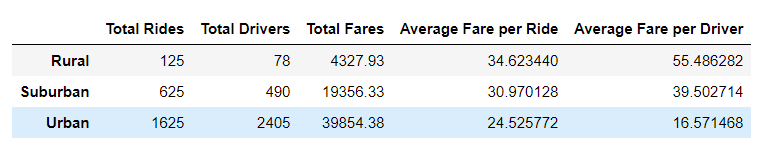
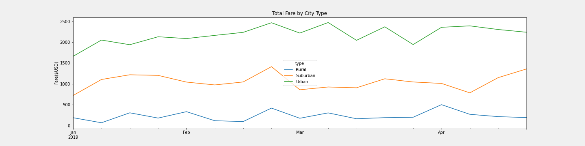

# PyBer Analysis

## Overview 
The CEO of PyBer gave me and Omar a new assignment. It's to create a summary DataFrame of the ride-sharing data by city type (Rural, Suburban, and Urban) and to create a multi-line graph showing the total weekly fares per city type. The time period requested was the months of January through April 2019. Then, I will summarize how the data differs by city type and provide recommendations as to how those differences can be used to make better decisions at PyBer.

For this assignment, I used Python in Jupyter Notebooks and the Pandas library. My input files were:

- city_data.csv
- ride_data.csv

## Results
First, I combined the city and ride data into one dataset: 

    

From this I conclude:

- Rural cities have the fewest total rides with the average fare being the highest at $34. This is due to riders going longer distances. Drivers in this market make the most money at $55 average per ride.

- Suburban cities have the average fare for rides in the middle at $30. Drivers in this market make $39 per ride.

- Urban cities have the highest number of total rides; however, the average fare is the lowest at $24. This is due to riders going shorter distances. Drivers in this market make the least amount of money at $16 per ride.

Then, I used the pivot and resample functions to read the data by the date range requested. Using Metaplotlib, I came up with this multi-line chart:

  

From this I conclude:
-  Urban fares per week are highest, with Suburban second and Rural third. This is to be expected, as urban cities have more demand.
-  Suburban fares are somewhat more consistent than the other types and don't have as many spikes as Urban and Rural fares.
-  Unlike Urban and Rural fares, Suburban fares go steadily up the second to fourth weeks of April.
-  Urban and Suburban fares go up after the new year, whereas Rural fares go down.
-  All city types have a surge around the third week of February. This could be due to President's Week, which most schools recognize as a holiday. 
-  Urban and Suburban fares have spikes the third week of March. This could be due to people visiting bars on St. Patrick's Day.
-  Unlike Suburban fares, Urban and Rural fares have a spike around April 1. i

## Summary
By looking at the data, my business recommendations to the CEO are:

- In Rural cities, use marketing to add more drivers.
- In Urban cities, run driver bonuses to encourage drivers to work during high demand periods, thereby making their average fare per ride higher.
- Some holidays (such as President's Week) seem to affect all three markets, so run driver bonuses to address demand. Other holidays (such as St. Patrick's Day) only affect Urban and Suburban cities.

